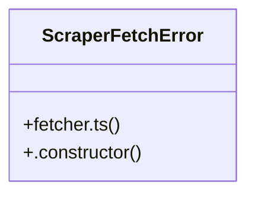

# Community 4

> 20 nodes · cohesion 0.19

## Key Concepts

- [fetcher.ts](file:///Users/mlp/Projekte/marketmind/marketmind/server/services/scraper/fetcher.ts#L1) (19 connections)
- [fetchWithConfig()](file:///Users/mlp/Projekte/marketmind/marketmind/server/services/scraper/fetcher.ts#L248) (16 connections)
- [warmUpOrigin()](file:///Users/mlp/Projekte/marketmind/marketmind/server/services/scraper/fetcher.ts#L167) (6 connections)
- [buildRequestHeaders()](file:///Users/mlp/Projekte/marketmind/marketmind/server/services/scraper/fetcher.ts#L81) (4 connections)
- [mergeCookies()](file:///Users/mlp/Projekte/marketmind/marketmind/server/services/scraper/fetcher.ts#L139) (4 connections)
- [blockedMessage()](file:///Users/mlp/Projekte/marketmind/marketmind/server/services/scraper/fetcher.ts#L225) (3 connections)
- [createFetcherSession()](file:///Users/mlp/Projekte/marketmind/marketmind/server/services/scraper/fetcher.ts#L52) (3 connections)
- [detectPlatform()](file:///Users/mlp/Projekte/marketmind/marketmind/server/services/scraper/fetcher.ts#L65) (3 connections)
- [getCachedHtml()](file:///Users/mlp/Projekte/marketmind/marketmind/server/services/scraper/fetcher.ts#L199) (3 connections)
- [cookieHeaderForOrigin()](file:///Users/mlp/Projekte/marketmind/marketmind/server/services/scraper/fetcher.ts#L156) (2 connections)
- [extractSetCookies()](file:///Users/mlp/Projekte/marketmind/marketmind/server/services/scraper/fetcher.ts#L130) (2 connections)
- [getNextUserAgent()](file:///Users/mlp/Projekte/marketmind/marketmind/server/services/scraper/fetcher.ts#L56) (2 connections)
- [isCacheValid()](file:///Users/mlp/Projekte/marketmind/marketmind/server/services/scraper/fetcher.ts#L193) (2 connections)
- [originKey()](file:///Users/mlp/Projekte/marketmind/marketmind/server/services/scraper/fetcher.ts#L71) (2 connections)
- [ScraperFetchError](file:///Users/mlp/Projekte/marketmind/marketmind/server/services/scraper/fetcher.ts#L38) (2 connections)
- [setCachedHtml()](file:///Users/mlp/Projekte/marketmind/marketmind/server/services/scraper/fetcher.ts#L215) (2 connections)
- [warmUpUrl()](file:///Users/mlp/Projekte/marketmind/marketmind/server/services/scraper/fetcher.ts#L75) (2 connections)
- [lastFetchTime](file:///Users/mlp/Projekte/marketmind/marketmind/server/services/scraper/fetcher.ts#L50) (1 connections)
- [.constructor()](file:///Users/mlp/Projekte/marketmind/marketmind/server/services/scraper/fetcher.ts#L39) (1 connections)
- [USER_AGENTS](file:///Users/mlp/Projekte/marketmind/marketmind/server/services/scraper/fetcher.ts#L3) (1 connections)

## Class Diagram

## Relationships

- No strong cross-community connections detected

## Source Files

- [/Users/mlp/Projekte/marketmind/marketmind/server/services/scraper/fetcher.ts](file:///Users/mlp/Projekte/marketmind/marketmind/server/services/scraper/fetcher.ts)

## Audit Trail

- EXTRACTED: 75 (94%)
- INFERRED: 5 (6%)
- AMBIGUOUS: 0 (0%)

---

*Part of the graphify knowledge wiki. See [[index]] to navigate.*