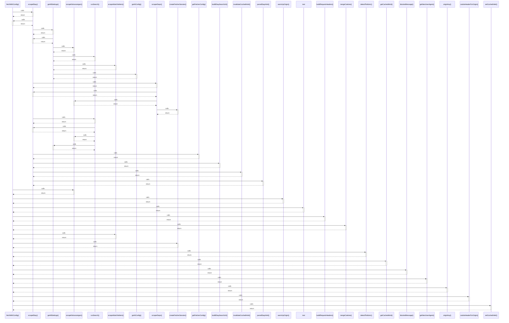

# fetchWithConfig()

> God node · 16 connections · [/Users/mlp/Projekte/marketmind/marketmind/server/services/scraper/fetcher.ts](file:///Users/mlp/Projekte/marketmind/marketmind/server/services/scraper/fetcher.ts#L248)

## Call Trace Diagram

## Connections by Relation

### calls
- [[scrapeEbay()]] `INFERRED`
- [[scrapeKleinanzeigen()]] `INFERRED`
- [[warmUpOrigin()]] `EXTRACTED`
- [[text]] `INFERRED`
- [[buildRequestHeaders()]] `EXTRACTED`
- [[mergeCookies()]] `EXTRACTED`
- [[scrapeWatchlistItem()]] `INFERRED`
- [[createFetcherSession()]] `EXTRACTED`
- [[detectPlatform()]] `EXTRACTED`
- [[getCachedHtml()]] `EXTRACTED`
- [[blockedMessage()]] `EXTRACTED`
- [[getNextUserAgent()]] `EXTRACTED`
- [[originKey()]] `EXTRACTED`
- [[cookieHeaderForOrigin()]] `EXTRACTED`
- [[setCachedHtml()]] `EXTRACTED`

### contains
- [[fetcher.ts]] `EXTRACTED`

---

*Part of the graphify knowledge wiki. See [[index]] to navigate.*