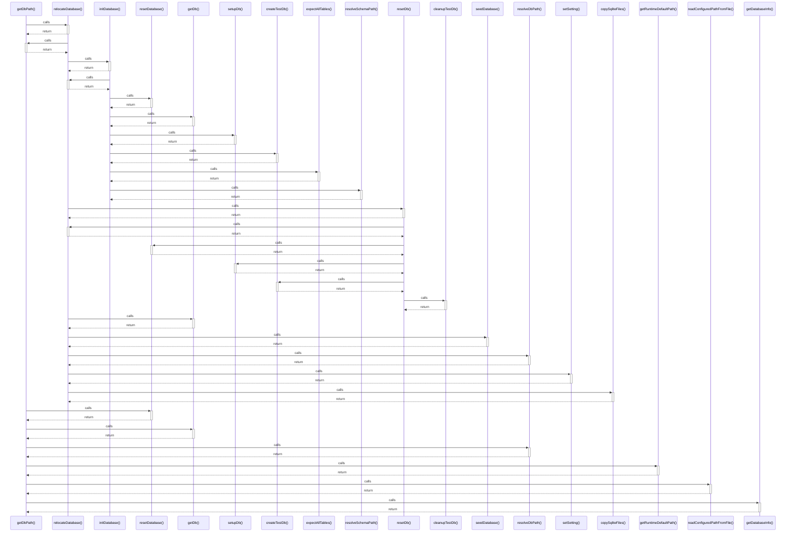

# getDbPath()

> God node · 8 connections · [/Users/mlp/Projekte/marketmind/marketmind/server/database/db.ts](file:///Users/mlp/Projekte/marketmind/marketmind/server/database/db.ts#L29)

## Call Trace Diagram

## Connections by Relation

### calls
- [[relocateDatabase()]] `INFERRED`
- [[resetDatabase()]] `INFERRED`
- [[getDb()]] `EXTRACTED`
- [[resolveDbPath()]] `INFERRED`
- [[getRuntimeDefaultPath()]] `INFERRED`
- [[readConfiguredPathFromFile()]] `INFERRED`
- [[getDatabaseInfo()]] `INFERRED`

### contains
- [[db.ts]] `EXTRACTED`

---

*Part of the graphify knowledge wiki. See [[index]] to navigate.*