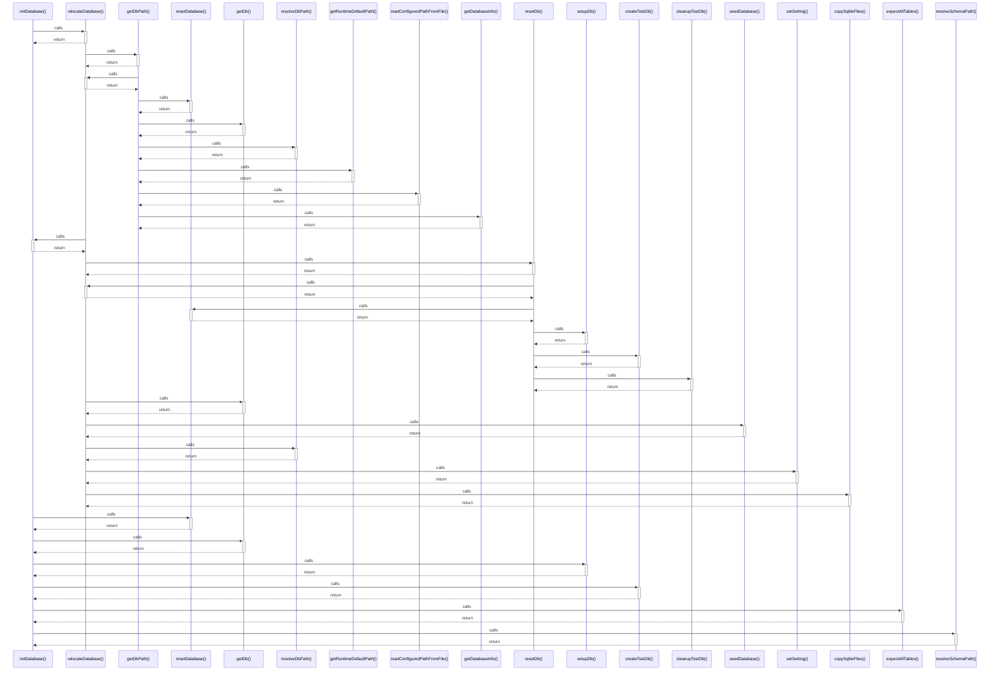

# initDatabase()

> God node · 8 connections · [/Users/mlp/Projekte/marketmind/marketmind/server/database/db.ts](file:///Users/mlp/Projekte/marketmind/marketmind/server/database/db.ts#L92)

## Call Trace Diagram

## Connections by Relation

### calls
- [[relocateDatabase()]] `INFERRED`
- [[resetDatabase()]] `INFERRED`
- [[getDb()]] `EXTRACTED`
- [[setupDb()]] `INFERRED`
- [[createTestDb()]] `INFERRED`
- [[expectAllTables()]] `INFERRED`
- [[resolveSchemaPath()]] `EXTRACTED`

### contains
- [[db.ts]] `EXTRACTED`

---

*Part of the graphify knowledge wiki. See [[index]] to navigate.*