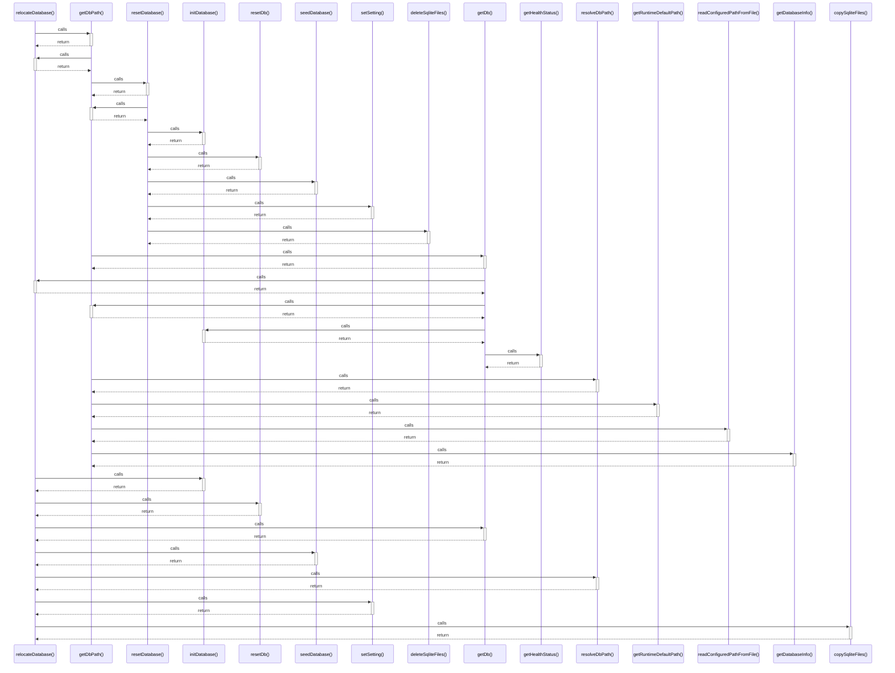

# relocateDatabase()

> God node · 9 connections · [/Users/mlp/Projekte/marketmind/marketmind/server/services/database/admin.ts](file:///Users/mlp/Projekte/marketmind/marketmind/server/services/database/admin.ts#L40)

## Call Trace Diagram

## Connections by Relation

### calls
- [[getDbPath()]] `INFERRED`
- [[initDatabase()]] `INFERRED`
- [[resetDb()]] `INFERRED`
- [[getDb()]] `INFERRED`
- [[seedDatabase()]] `INFERRED`
- [[resolveDbPath()]] `INFERRED`
- [[setSetting()]] `INFERRED`
- [[copySqliteFiles()]] `EXTRACTED`

### contains
- [[admin.ts]] `EXTRACTED`

---

*Part of the graphify knowledge wiki. See [[index]] to navigate.*