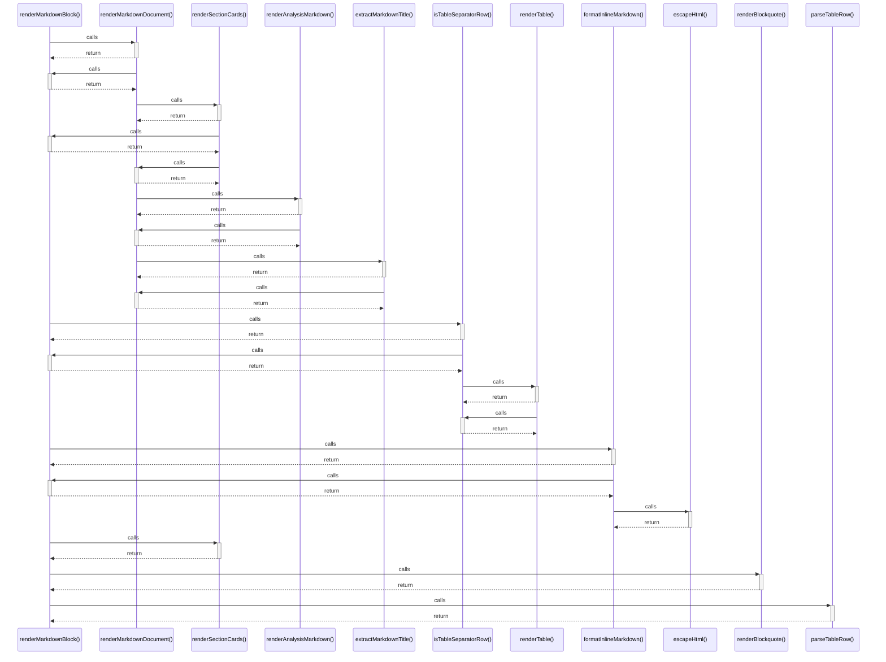

# renderMarkdownBlock()

> God node · 7 connections · [/Users/mlp/Projekte/marketmind/marketmind/app/utils/render-markdown.ts](file:///Users/mlp/Projekte/marketmind/marketmind/app/utils/render-markdown.ts#L110)

## Call Trace Diagram

## Connections by Relation

### calls
- [[renderMarkdownDocument()]] `EXTRACTED`
- [[isTableSeparatorRow()]] `EXTRACTED`
- [[formatInlineMarkdown()]] `EXTRACTED`
- [[renderSectionCards()]] `EXTRACTED`
- [[renderBlockquote()]] `EXTRACTED`
- [[parseTableRow()]] `EXTRACTED`

### contains
- [[render-markdown.ts]] `EXTRACTED`

---

*Part of the graphify knowledge wiki. See [[index]] to navigate.*