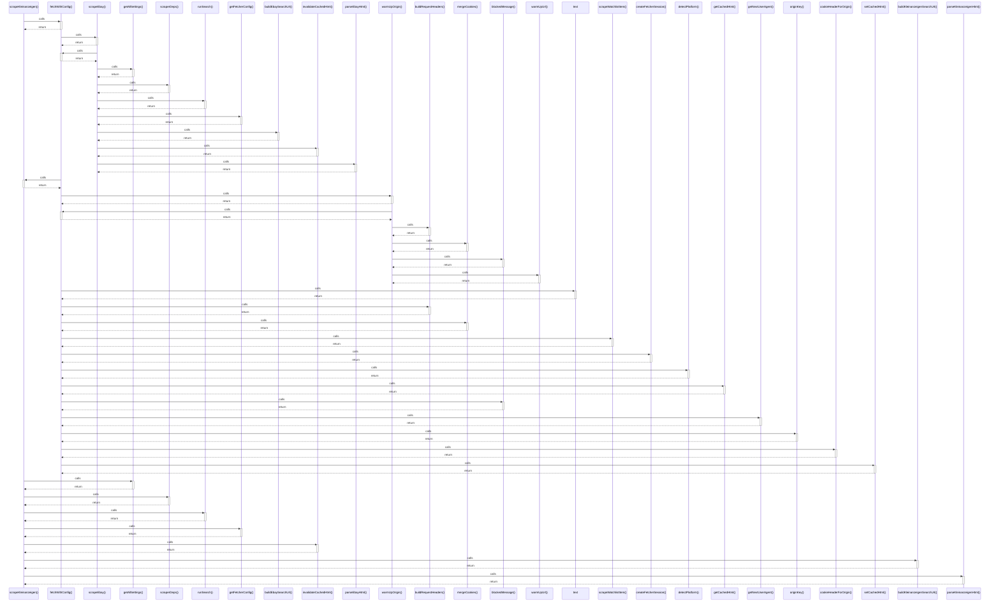

# scrapeKleinanzeigen()

> God node · 9 connections · [/Users/mlp/Projekte/marketmind/marketmind/server/services/scraper/index.ts](file:///Users/mlp/Projekte/marketmind/marketmind/server/services/scraper/index.ts#L98)

## Call Trace Diagram

## Connections by Relation

### calls
- [[fetchWithConfig()]] `INFERRED`
- [[getAllSettings()]] `INFERRED`
- [[scraperDeps()]] `EXTRACTED`
- [[runSearch()]] `EXTRACTED`
- [[getFetcherConfig()]] `EXTRACTED`
- [[invalidateCachedHtml()]] `INFERRED`
- [[buildKleinanzeigenSearchUrl()]] `INFERRED`
- [[parseKleinanzeigenHtml()]] `INFERRED`

### contains
- [[index.ts]] `EXTRACTED`

---

*Part of the graphify knowledge wiki. See [[index]] to navigate.*